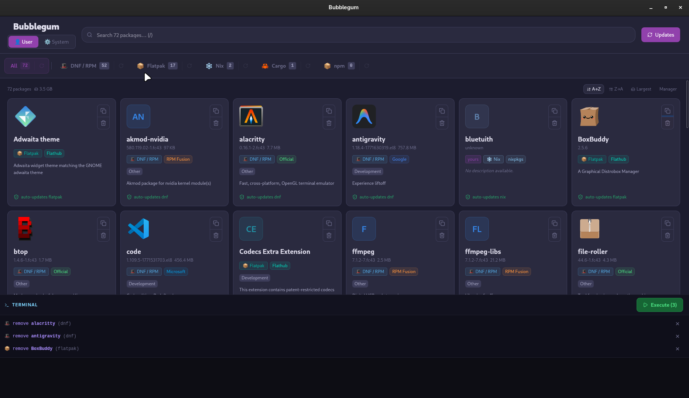

# 🫧 Bubblegum

> Due to Tauri v2 only supporting up to 60hz on Linux, I am going to rebuild the project in Electron for 120hz. The rebuild will be called Bubblegum 2.



A unified package manager GUI for Linux. Bubblegum gives you a single dashboard to browse, search, update, and uninstall packages across every package manager on your system.


## Installation

### Download (AppImage)

Grab the latest `.AppImage` from the [Releases](../../releases/latest) page and run it — no installation needed:

```bash
chmod +x bubblegum_*.AppImage
./bubblegum_*.AppImage
```

> **Transparent builds** — every release is built automatically by [GitHub Actions](.github/workflows/release.yml) on a clean Ubuntu 24.04 runner. The build is never touched by me manually; you can inspect the exact workflow that produced the binary directly in this repo.

### Build from Source

If you prefer to compile it yourself:

```bash
git clone https://github.com/YOUR_USERNAME/bubblegum
cd bubblegum
./run.sh --appimage   # auto-bootstraps a distrobox container, then builds
# → dist/bubblegum_*.AppImage
```

`run.sh` sets up an isolated Ubuntu 24.04 distrobox container automatically on first run — your host system stays untouched.

---

## Features

- **Unified view** — See every installed package in one place, grouped by source
- **Multi-manager support** — apt, dnf, flatpak, pacman, snap, nix, cargo, npm
- **Arch Linux & AUR** — Classifies packages by repo (core/extra/multilib/AUR); uses paru/yay for AUR updates
- **Live streaming** — Package lists and updates stream in progressively (no frozen UI)
- **Bulk updates** — Update all packages per manager with a single click; firmware updates via fwupd
- **Batch uninstall** — Stage packages for removal and review the command before running it
- **Icon detection** — Automatically resolves application icons from `.desktop` files and icon themes
- **Distrobox-aware** — Works transparently inside distrobox containers by querying the host
- **Built-in terminal** — Watch command output in a live terminal panel without leaving the app

## Supported Package Managers

| Manager | Packages | Updates | Uninstall | Notes                                |
| ------- | :------: | :-----: | :-------: | ------------------------------------ |
| APT     |    ✅    |   ✅    |    ✅     | Debian / Ubuntu                      |
| DNF/RPM |    ✅    |   ✅    |    ✅     | Fedora / RHEL                        |
| Pacman  |    ✅    |   ✅    |    ✅     | Arch Linux (core / extra / multilib) |
| AUR     |    ✅    |   ✅    |    ✅     | Via paru or yay                      |
| Flatpak |    ✅    |   ✅    |    ✅     |                                      |
| Snap    |    ✅    |   ✅    |    ✅     |                                      |
| Nix     |    ✅    |   ✅    |    ✅     |                                      |
| Cargo   |    ✅    |    —    |     —     | Read-only listing                    |
| npm     |    ✅    |    —    |     —     | Read-only listing                    |

## Development

| Command               | Description                        |
| --------------------- | ---------------------------------- |
| `./run.sh --dev`      | Hot-reload dev mode via distrobox  |
| `./run.sh --build`    | Release binary via distrobox       |
| `./run.sh --appimage` | AppImage bundle via distrobox      |
| `cargo tauri dev`     | Dev mode (inside container/manual) |
| `cargo tauri build`   | Release build (inside container)   |
| `npm run dev`         | Frontend-only dev server           |

## Contributing

Contributions are welcome! Please open an issue first to discuss what you'd like to change.

## License

[AGPL-3.0](LICENSE)
